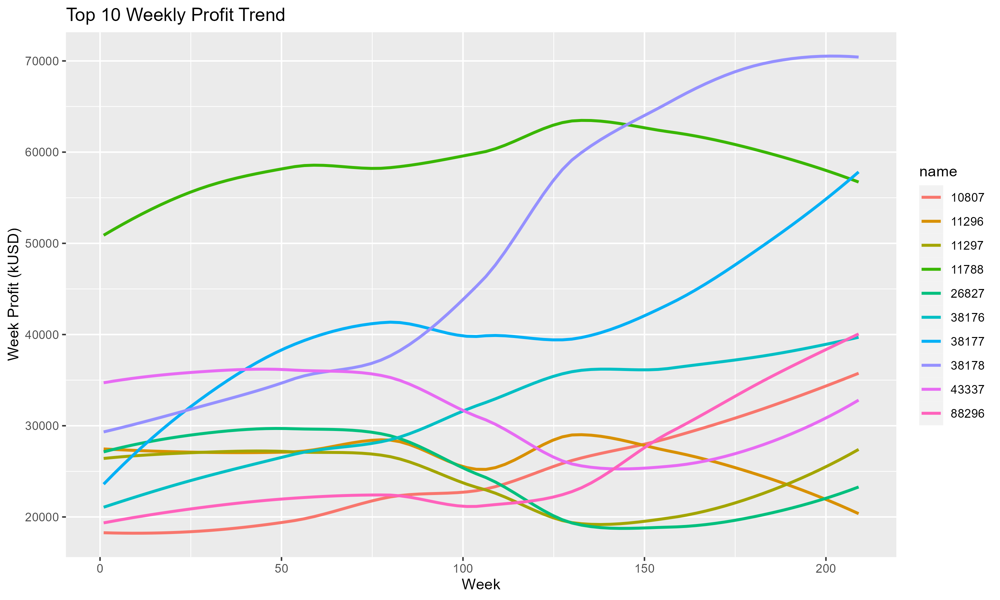

```{r setup, include=FALSE}
knitr::opts_chunk$set(echo = TRUE)
```


### Background
  The pandemic of COVID-19 hit the world by surprise in early 2020 and had since left profound impacts to social, economical, and physiological aspects. As a worldwide pandemic that’s not going away anytime soon, it has certainly caused significant changes to public behaviors. Many industries such as airlines, leisure facilities, auto parts, restaurants, and etc. were negatively impacted, so was the alcoholic beverages consumption. But according to the surveillance report from the National Institute on Alcohol Abuse and Alcoholism, alcoholic beverages sales increased while the most sales of food and other drinks decreased during the pandemic of COVID-19. Hence, we was particularly interested in the economical impacts due to the pandemic. Through investigation on alcohol sales in Iowa, we tried to figure out economic influences of the pandemic. And we believe that the analysis of the Iowa alcohol sales data provided a good reference to the overall trend in the retail sector. 

### Dataset
  The data chosen for this analysis is the “Iowa Liquor Sales” data publicly available from the state of Iowa. More specifically, this data set contains the alcohol purchase records of Iowa Class “E” liquor licensees from January 1, 2012 to current. Class E liquor license, for grocery, liquor, convenience stores, etc., allows the above to sell liquor for off-premises consumption in unopened original containers in a commercial setting. For our analysis, sales data from Oct. 2017 to Oct. 2021 was selected, such as store, brand, sales volume, and sales price, considering data duplication, completion, etc. Overall, more than 9,900,000 observations and 24 variables were evaluated. The data is extremely large and intricate. It would be hard to do analysis directly. In the stage of data processing, we removed data entries with missing values due to the limitation in analyse methods and tried to use vectorization for better performance. Moreover, the original data (more than 2.4G) is transformed in different ways into small derived data for each method during the pre-processing. Only derived data will be included in github and makefile.

### Method
  To figure out the trends of alcohol sales and have a better understanding on the characteristics of popular alcohol drinks, we decided to use the following methods: Exploratory Data Analysis, Correlation Analysis and Classifications. In the Exploratory Data Analysis part, we summarized the statistics of our data using overall sales trends and tried to find the best methods for further analysis. Next, we simply conducted correlation analysis to see the associations for the quantitative variables between bottle sold and other variables. After that, glm and decision tree were applied to find potential characteristics of popular alcohol drinks.

### Results (Trend)





  To evaluate the influence of COVID-19 on liquor sales in Iowa, we first drew the trend for top 10 liquor sales. As the Loess smoothed weekly profit trend of liquors shows, during the four years, liquor profit grew steadily and eventually increased by 20 percent compared to 2017. At the start of the pandemic, around week 105, the profit was influenced a little bit, but quickly returned to a strong growth trend and grew even faster, which was consistent with previous research.Most maintained strong growth trends during the pandemic, while only 2 of 10 shows a significant decreasing trend of profits.


### Results (Correlation)


  We conducted a correlation matrix to present the correlations visually between the variables we were interested in. In a brief word, we can see that the bottles sold might be positively associated with how many stores(0.45), cities (0.39), counties (0.29) are selling that alcoholic beverage. The more counties, cities, stores selling a specific alcoholic beverage, the more popular that alcohol product is. And the number of packs might be also slightly positively associated with bottles sold. When there are more bottles in the pack, the bottles sold might be higher. 

  There might be a multicollinearity issue between Store.Number, County, and City at the same time because of the high correlations (greater than 0.80 for each pair of these three variables).

### Results (Classification)

  For the classification section, we tried to use Generalized Linear Model (GLM) and Decision Tree. We implemented classification for two response variables: One is for the general popularity of alcoholic beverages; The other is for the COVID popularity of alcoholic beverages. We defined the overall top 10% bottle sold alcoholic beverages as the general popular products, and we defined the alcoholic beverages that have more sales during the pandemic are the COVID popular products. The explanatory variables include Vendor, Category, Pack, Bottle Volume (ml), and so on. We randomly split the data into a training set (60%) and a test set (40%) to measure the accuracy of prediction which can reflect the reliability of the model.


  We can see that GLM provides a good accuracy for general popularity. But for COVID popularity, the GLM method is not applied because there is only one significant predictor after step wise selection. We cannot find a good threshold for that prediction. 


  For the general popularity, the decision tree shows that the most important predictors are Number of Stores (City, County), Category, and Retailed price. When an alcoholic beverage has a larger pack, larger bottle volume, lower retailed price, and more places people can buy, it tends to be a popular product(higher number of bottle sold). While for the COVID popularity, retailed price and category becomes the most important factors. However, the predictors in the data may not be significant enough as the low accuracy rates for the COVID popularity indicates. 


### Conclusion

  Based on Iowa liquor sales data from Oct. 31, 2017 to Oct. 31, 2021, we firstly verified that the alcohol industry maintained a strong growth trend during the covid pandemic. And the classification results show that the alcoholic beverage with a larger pack, larger bottle volume, lower retailed price, and more places people can buy would be more popular. We did not find the characteristics of the alcohol products which became more popular during the pandemic of COVID-19 based on our data.

  However, we still have some noticeable limitations on our study. Some variables have too many levels which are not compatible for some classifications. The variables in the dataset for classification might be insignificant. For the classifications, we cannot identify whether those characteristics, like bottle volume, pack, retailed price, and so on, make the alcohol products become popular. To investigate more for the popular alcohol products in the future study, more survey data is needed and some other analysis methods like time series may be needed.


